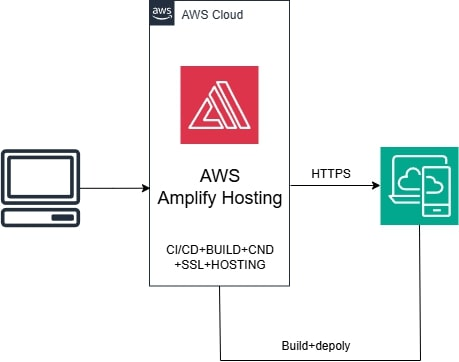

## 👨‍💻 จัดทำโดย

* นายกษิดิศ ทรงศิลป์  6652300877
* นายพิภพ มณีวรรณ์   6652300095
* นายสรวิชณ์ หอยสังข์  6652300061
* นายรพีภัทร คณะพล   6652300681
* นายธนโชติ วงศ์รู้คุณ  6652300664

---

# 🍽️ Queue Restaurant Frontend

ระบบ **Queue Management / Reservation System** สำหรับร้านอาหาร
พัฒนาด้วย **React + Vite + Tailwind CSS** และ Deploy บน **AWS Amplify Hosting**

---

## 📂 โครงสร้างโปรเจกต์

```plaintext
├── public/                 # ไฟล์ static เช่น icon, favicon
├── src/
│   ├── components/          # UI components (ปุ่ม, card, layout ฯลฯ)
│   ├── pages/               # หน้าเว็บหลัก เช่น Home, Reserve, TicketStatus
│   ├── router/              # กำหนดเส้นทาง (React Router)
│   ├── App.tsx              # Root component
│   └── main.tsx             # Entry point ของ React
├── vite.config.ts           # การตั้งค่า Vite
├── tailwind.config.js       # การตั้งค่า Tailwind
├── package.json
└── README.md
```

---

## 🧭 Flow ของระบบ 



---

## 🔧 การทำงานของระบบ

### 1) ผู้ใช้นำลิงก์

* ผู้ใช้เข้าลิงก์ Amplify หรือ Domain ของระบบ

### 2) Amplify Hosting

* ส่ง `index.html` + bundle (JS/CSS) ให้

### 3) React

* Mount `<div id="root">` และ render UI

### 4) React Router

* ควบคุมเส้นทาง

  * `/home` → หน้าแรก
  * `/reserve` → จองคิว
  * `/ticketstatus` → สถานะคิว
  * `/confirmattendance` → ยืนยันการมา
  * `/searchtickets` → ค้นหาตั๋ว

### 5) การทำงานแบบ SPA

* ทุกการเปลี่ยนหน้าเกิดที่ฝั่ง Client (SPA) → ไม่ reload ทั้งหน้า

---

## 🚀 การ Deploy (AWS Amplify Hosting)

1. Push โค้ดขึ้น GitHub

```bash
git add .
git commit -m "update"
git push origin main
```

2. Amplify Hosting จะ trigger pipeline อัตโนมัติ:

* ติดตั้ง dependency: `npm ci`
* build โปรเจกต์: `npm run build`
* deploy ไฟล์ `dist/` ไปที่ Static Hosting

3. ผู้ใช้เปิดเว็บ → จะได้หน้าเวอร์ชันล่าสุดโดยอัตโนมัติ

---


